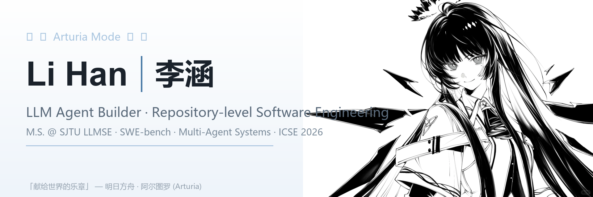
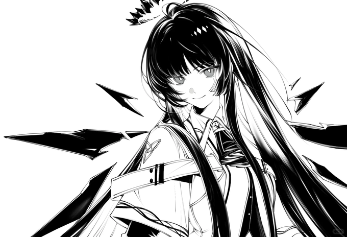

  

<h1 align="center">李涵 · Li Han</h1>

  Master student @ SJTU LLMSE · LLM agent builder · repository-level software engineering

  
  
  
  
  

  <a href="https://lihan0421.github.io/">Website</a> ·
  <a href="mailto:lihan0421@sjtu.edu.cn">Email</a> ·
  <a href="https://scholar.google.com/citations?user=3iHsla4AAAAJ&hl=zh-CN">Google Scholar</a> ·
  <a href="https://github.com/YerbaPage">Lab</a>

---

### 献给你的乐章 · A Song for the World

I am Han Li, a master's student in the [LLM for Software Engineering Lab (LLMSE)](https://github.com/YerbaPage)
at Shanghai Jiao Tong University, advised by Prof. Xiaodong Gu and Prof. Beijun Shen.
I build **LLM agents for software engineering** — and, like a certain Lateran musician,
I believe every piece of code can be played into a clean, debuggable melody.

| Focus | What I Care About |
| --- | --- |
| Coding agents | perception, planning, memory, tool use, debugging, testing |
| Repository-level SE | long-context code understanding, dependency reasoning, issue localization |
| Agent orchestration | multi-agent debate, self-evolving experience pools, skill distillation |
| Evaluation | SWE-bench style tasks, verifiable tests, benchmark reliability |
| Agent infrastructure | cluster-scale training orchestration, monitor-and-heal pipelines |

---

### Selected Projects

| Project | Stars | Direction |
| --- | ---: | --- |
| [SWE-Debate](https://github.com/YerbaPage/SWE-Debate) |  | Competitive multi-agent debate for software issue resolution · [ICSE 2026] |
| [SkillForge](https://github.com/cslsolow/SkillForge) |  | Self-distilling agents for project-specific issue resolution |
| [deepseek-harness-whitebook](https://github.com/lihan0421/deepseek-harness-whitebook) |  | 逐代码段解析 deepseek-harness 的白皮书站点 |
| [Furina-skillhub](https://github.com/lihan0421/Furina-skillhub) |  | Curated agent skills hub, synced from local skills |
| [Awesome-Repo-Level-Code-Generation](https://github.com/YerbaPage/Awesome-Repo-Level-Code-Generation) |  | Must-read papers on repo-level code generation & issue resolution |
| [novel-reader](https://github.com/lihan0421/novel-reader) |  | Read novels, one chapter at a time |

---

### Research Console

  
  

  <picture>
    <source media="(prefers-color-scheme: dark)" srcset="https://raw.githubusercontent.com/lihan0421/lihan0421/output/github-contribution-grid-snake-dark.svg" />
    <source media="(prefers-color-scheme: light)" srcset="https://raw.githubusercontent.com/lihan0421/lihan0421/output/github-contribution-grid-snake.svg" />
    
  </picture>

---

### Tech Stack

  
  
  
  
  
  
  
  

---

Arturia-themed profile notes

This profile is themed around **Arturia (阿尔图罗)** from *Arknights* — a Lateran
musician who plays a "song for the world". The visual language follows her score:
white paper, ink lines, and ice-blue accents. Restrained, like a clean staff.

The same instinct guides the research here: a repository is a composition, a bug
is a wrong note, and an agent is a performer learning to play it right.

If a visual element does not help people understand what I build, it does not
belong here. Yes, even if it is pretty. Especially then.

  

  アルトゥリア · 奏者 · 献给世界的乐章 — Code, Debug, Review

  Artwork: 明日方舟 · 阿尔图罗 (Arknights © Hypergryph), fan-art appreciation only.

